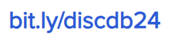

{: .welcome} 

#### Orario delle lezioni

| Giorno          | Aula |
| :-------------: |      |
| Giovedì 9-12 |  D44  | 
| Venerdì 8-11 |  D03  | 

#### Comunicazioni
{: #tag}

Durante il corso si utilizzerà **Discord** come canale principale di comunicazioni e per il supporto agli studenti.
Di seguito l'indirizzo per accedere al server del corso:

#### Lezioni

Il programma delle lezioni è provvisorio e può subire variazioni.

| Argomento                                          | Data           |Orario           | Slides                          | Codice/Altro|
|----------------------------------------------------|----------------|---------------- |-------------------------------  |-----------------|
| Introduzione Corso                                 | 08 Marzo 2024  |8:00-10:00       |[Introduzione](https://bit.ly/43cYYpx)                   |                 | 
| Modello relazionale                                | 08 Marzo 2024  |8:00-10:00       |[Modello Relazionale](https://bit.ly/48Mxg44)            |                 |
| Algebra relazionale                                | 14 Marzo 2024  |9:00-11:00       |[Algebra Relazionale](https://tinyurl.com/algebrarelaz)  |                 |
| Esercitazione Algebra relazionale                  | 15 Marzo 2024  |8:00-11:00       |[Testo 1](https://tinyurl.com/es1algrel) [Soluzione1](https://tinyurl.com/es1sol)    [Testo 2](https://tinyurl.com/es2algrel) [Soluzione2](https://tinyurl.com/es2sol)                                |[How To Use Relax](https://tinyurl.com/useRelax)              |
| SQL: Concetti di base + MySQL                      | 21 Marzo 2024  |9:00-11:00             |[SQL base](https://studentiunict-my.sharepoint.com/:b:/g/personal/f_proiettosalanitri_unict_it/EQayLibXXMtPmeNbX_C4RBsBx68lCU3TQK1H36LsjtqyZQ?e=Sq0Bgl)          |[MySQL](https://studentiunict-my.sharepoint.com/:b:/g/personal/f_proiettosalanitri_unict_it/EUHODtxLUdxOi4NzHtwVlmIB1-WPl5hKXWhLKTbuMKraOw?e=ZOWG3o)                 |
| SQL Operatori Aggregati + Esercitazione MySQL Base | 22 Marzo 2024  |8:00-11:00             |[Esercitazione](https://studentiunict-my.sharepoint.com/:b:/g/personal/f_proiettosalanitri_unict_it/ETRIIwPQmipOmOqMjuNXEVQBpz7fXiuMNacVZRvBDCXxtQ?e=1FYnBx) [Soluzione](https://tinyurl.com/esercsol2)   [SQL Op. Aggreg.](https://studentiunict-my.sharepoint.com/:b:/g/personal/f_proiettosalanitri_unict_it/EUJlYmuHlDlOlrB8aLUKBZ8BtJpv7h4Y8J1tDVRkD1dY7Q?e=oZAdRT)               | [dati_eserc](https://studentiunict-my.sharepoint.com/:u:/g/personal/f_proiettosalanitri_unict_it/EZvJVPKUHU9PkOaFjyW2uNwBO4pcPwOQxXr6N1iQFZkQ9Q?e=VfLZT1)                |
| SQL Query Nidificate + Esercitazione op. aggregati | 28 Marzo 2024  |9:00-12:00             |[SQL Query nidificate](https://tinyurl.com/querynidif) | [Esercizio 1](https://tinyurl.com/es1aggr) [Soluzione1](https://tinyurl.com/sol1aggr)   [Esercizio 2](https://tinyurl.com/es2aggrnidif) [Soluzione2](https://tinyurl.com/sol2nidif)   [dati1](https://tinyurl.com/esdat1)   [dati2](https://tinyurl.com/esdat2)       |
| SQL Avanzato: Stored Procedure e Trigger           | 29 Marzo 2024  |8:00-11:00             | [Procedure e Trigger](https://tinyurl.com/proctrig)                                |                 |
| Esercitazione  Procedure + Trigger                 | 04 Aprile 2024 |9:00-12:00             |   | [Esercizio](https://tinyurl.com/esprotrig) [Soluzione](https://tinyurl.com/solprotrig)  [dati](https://tinyurl.com/protrigdati) [tables](https://tinyurl.com/tabespro)                 |
| Esercitazione  Complessiva SQL - 1                 | 05 Aprile 2024 |8:00-11:00             |                              | [Esercitazione](https://studentiunict-my.sharepoint.com/:b:/g/personal/f_proiettosalanitri_unict_it/EclR4npL2UlJg0WlRzj_zZwBr4B6cHlyWJhfuP0LxLDNLg?e=eNhlsA)   [dati](https://studentiunict-my.sharepoint.com/:u:/g/personal/f_proiettosalanitri_unict_it/EStWqd999YtKjQdqnDztzB4BCsXCqLRiQV0K0r3rs7CK_A?e=96qpxG)   [Soluzione](https://tinyurl.com/9essol)                 |
| Esercitazione  Complessiva SQL - 2                 | 11 Aprile 2024 |8:00-11:00             |                                 |[Esercitazione](https://tinyurl.com/es1104) [dati](https://tinyurl.com/dati1104)   [Soluzione](https://tinyurl.com/10soles)                 |
| Simulazione Prova in itinere                       | 12 Aprile 2024 |9:00-12:00             | | [Testo](https://studentiunict-my.sharepoint.com/:b:/g/personal/simone_palazzo_unict_it/ETG6PpMprShPgl3ehDXHZ6YBSxp5LMeDjEtXiQ0D04QYqA?e=QLc3n4), [Soluzione](https://studentiunict-my.sharepoint.com/:u:/g/personal/simone_palazzo_unict_it/EXKNtto2dDNMtjij1LHwf3EBa0yyURGfVZtpaoKpvUKySw?e=wVIZRj)                                |                 
| **Prova in itinere  SQL**                          | **29 Aprile 2024** |15:00-19:00        |                                 |                 | 
| Progettazione Concettuale                          | 02 Maggio 2024 |10:00-12:00            | [Progettazione Concettuale](https://tinyurl.com/13progConc) |                 |
| Esempi progettazione concettuale                   | 03 Maggio 2024 |8:00-11:00             |                                 |                 |
| Progettazione logica                               | 16 Maggio 2024 |10:00-12:00            |                                 |                 |
| Esercitazione progettazione logica                 | 17 Maggio 2024 |8:00-11:00             |                                 |                 |
| Esercitazione progettazione                        | 23 Maggio 2024 |9:00-12:00            |                                 |                 |
| Esercitazione progettazione                        | 24 Maggio 2024 |8:00-11:00             |                                 |                 |
| NoSQL                                              | 30 Maggio 2024 |8:00-12:00             |                                 |                 |
| Esercitazione NoSQL                                | 31 Maggio 2024 |8:00-11:00             |                                 |                 |
| **Prova in itinere Progettazione**                 | 07 Giugno 2024 |TBD                    |                                 |                 | 

#### Esami

Gli studenti che **frequentano** il corso possono partecipare alle due prove in itinere, che saranno svolte durante il periodo delle lezioni: 1) prova pratica di SQL; 2) prova di progettazione.

Qualora una delle due prove in itinere previste non venisse superata, potrà essere recuperata **solo** durante il primo appello della materia.  

In alternativa, è possibile sostenere una prova integrata nelle date degli appelli ufficiali del corso, disponibili [qui](https://www.dieei.unict.it/sites/default/files/files/CalendarioEsami_L8INF_2023-2024_v2.pdf).
La prova integrata consiste nella progettazione di una base di dati, a partire dai requisiti forniti, e la successiva implementazione in SQL.

In tutti i casi, è **obbligatoria** la prenotazione tramite il Portale studenti o Studium (secondo indicazioni dei docenti).

#### Prove in itinere
**Prova in itinere 1: SQL**

L'accesso alla prova in itinere è subordinato alla consegna di:
  - almeno 2 delle 3 esercitazioni che verranno svolte in aula. La consegna delle esercitazioni deve avvenire alla fine della lezione stessa.
    
|#      | Esercitazioni                             | Data Esercitazione | 
|------ | ----------------------------------------- | -----------------  | 
| 1     | Esercitazione  Complessiva SQL - 1        | 05 Aprile 2024     | 
| 2     | Esercitazione  Complessiva SQL - 2        | 12 Aprile 2024     | 
| 3     | Simulazione Prova in itinere              | 18 Aprile 2024     |
    
  - almeno 4 dei 5 homework che verranno assegnati durante la prima metà del corso
    
|#      | Homework                  | Data Assegnazione          | Data Consegna    |
|------ | ------------------------- | -----------------------    | ---------------- |
| 1     | [Algebra Relazionale](https://tinyurl.com/relalghw1)   | 15 Marzo 2024     | 22 Marzo 2024    |
| 2     | [MySQL Base](https://tinyurl.com/hw2basesql)           | 22 Marzo 2024     | 29 Marzo 2024    |
| 3     | [SQL Operatori Aggregati](https://tinyurl.com/hw3aggr) | 28 Marzo 2024     | ~~04 Aprile 2024~~ 08 Aprile 2024   |
| 4     | [Procedure e Trigger](https://tinyurl.com/hw4trigger)  | 29 Marzo 2024     | ~~09 Aprile 2024~~ 15 Aprile 2024  |

**Prova in itinere 2: Progettazione**

#### Contatti e ricevimento

- [Federica Proietto Salanitri](mailto:federica.proiettosalanitri@unict.it)

Gli orari di ricevimento sono i seguenti:
- mercoledì, dalle 17 alle 18

I ricevimenti possono essere tenuti in presenza, presso il Polo Tecnologico, Lab. Mednetna, o online.
È consigliabile contattare il docente via e-mail prima di presentarsi al ricevimento, per ogni evenienza.
